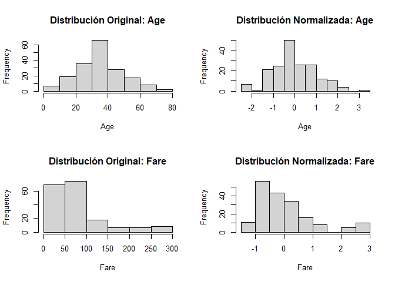

Laboratorio#9 - Missing Data and Feature Engineering
================
Christian Barrios
2024-11-15

``` r
knitr::opts_chunk$set(echo = TRUE)

library(caret)
```

    ## Warning: package 'caret' was built under R version 4.3.3

    ## Loading required package: ggplot2

    ## Warning: package 'ggplot2' was built under R version 4.3.3

    ## Loading required package: lattice

``` r
library(dplyr)

titanic_MD <- read.csv("titanic_MD.csv")
titanic_og <- read.csv("titanic.csv")
```

## Parte 1: Missing Data y Feature Engineering

### Reporte de Datos Faltantes

``` r
missing_data_report <- function(df) {
  data.frame(
    Variable = names(df),
    Missing = sapply(df, function(x) sum(is.na(x))),
    Percentage = sapply(df, function(x) mean(is.na(x)) * 100)
  )
}

# Generar reporte
missing_data_summary <- missing_data_report(titanic_MD)
missing_data_summary
```

    ##                Variable Missing Percentage
    ## PassengerId PassengerId       0   0.000000
    ## Survived       Survived       0   0.000000
    ## Pclass           Pclass       0   0.000000
    ## Name               Name       0   0.000000
    ## Sex                 Sex       0   0.000000
    ## Age                 Age      25  13.661202
    ## SibSp             SibSp       3   1.639344
    ## Parch             Parch      12   6.557377
    ## Ticket           Ticket       0   0.000000
    ## Fare               Fare       8   4.371585
    ## Cabin             Cabin       0   0.000000
    ## Embarked       Embarked       0   0.000000

### 2. Modelos de Imputacion y Justificacion

### Justificación de Métodos

1.  **Age**:
    - Se utilizó la **mediana** para imputar valores faltantes, ya que
      este método es resistente al impacto de outliers, asegurando que
      el valor imputado sea representativo de la distribución general de
      las edades.
2.  **Fare**:
    - Se utilizó la **moda**, dado que esta columna contiene valores
      discretos y el valor más común es un buen representante de los
      datos originales.
3.  **SibSp y Parch**:
    - Para estas variables, también se utilizó la **moda**, ya que son
      variables discretas (número de hermanos, cónyuges o padres a
      bordo), y el valor más común es representativo del comportamiento
      general.
4.  **Sex**:
    - En este caso, se utilizó una imputación basada en
      **proporciones**. Se calcularon los porcentajes de hombres y
      mujeres en los datos originales y, utilizando estas proporciones,
      se asignaron valores a las observaciones faltantes para mantener
      la consistencia entre categorías.

### 3. Reporte de Filas Completas

``` r
complete_rows <- complete.cases(titanic_MD)
num_complete_rows <- sum(complete_rows)
percentage_complete_rows <- (num_complete_rows / nrow(titanic_MD)) * 100

num_complete_rows
```

    ## [1] 141

``` r
percentage_complete_rows
```

    ## [1] 77.04918

### 4. Imputacion de Datos y Manejo de Outliers

``` r
# Verificar y limpiar columnas numéricas
numeric_cols <- c("Age", "Fare", "SibSp", "Parch")

# Limpiar y convertir a numérico
titanic_MD[numeric_cols] <- lapply(titanic_MD[numeric_cols], function(x) {
  # Convertir a numérico, reemplazando caracteres no numéricos por NA
  as.numeric(as.character(x))
})

# Confirmar que las columnas son numéricas
str(titanic_MD)
```

    ## 'data.frame':    183 obs. of  12 variables:
    ##  $ PassengerId: int  2 4 7 11 12 22 24 28 53 55 ...
    ##  $ Survived   : int  1 1 0 1 1 1 1 0 1 0 ...
    ##  $ Pclass     : int  1 1 1 3 1 2 1 1 1 1 ...
    ##  $ Name       : chr  "Cumings, Mrs. John Bradley (Florence Briggs Thayer)" "Futrelle, Mrs. Jacques Heath (Lily May Peel)" "McCarthy, Mr. Timothy J" "Sandstrom, Miss. Marguerite Rut" ...
    ##  $ Sex        : chr  "?" "female" "male" "female" ...
    ##  $ Age        : num  38 35 54 NA 58 34 NA 19 49 65 ...
    ##  $ SibSp      : num  1 1 0 1 NA 0 0 3 1 0 ...
    ##  $ Parch      : num  0 0 0 NA 0 0 0 2 NA 1 ...
    ##  $ Ticket     : chr  "PC 17599" "113803" "17463" "PP 9549" ...
    ##  $ Fare       : num  71.3 53.1 51.9 16.7 26.6 ...
    ##  $ Cabin      : chr  "C85" "C123" "E46" "G6" ...
    ##  $ Embarked   : chr  "C" "S" "S" "S" ...

``` r
# Función para imputar datos (modificada)
impute_missing <- function(df, method, column, model = NULL) {
  if (method == "median") {
    df[[column]][is.na(df[[column]])] <- median(df[[column]], na.rm = TRUE)
  } else if (method == "mode") {
    mode_value <- names(sort(table(df[[column]]), decreasing = TRUE))[1]
    # Convert mode_value to numeric if the column is numeric
    if (is.numeric(df[[column]])) {
      mode_value <- as.numeric(mode_value)
    }
    df[[column]][is.na(df[[column]])] <- mode_value
  } else if (method == "regression") {
    predicted <- predict(model, newdata = df)
    df[[column]][is.na(df[[column]])] <- predicted[is.na(df[[column]])]
  }
  return(df)
}

# Imputar valores faltantes (modificado)
titanic_MD <- impute_missing(titanic_MD, method = "median", column = "Age")
titanic_MD <- impute_missing(titanic_MD, method = "median", column = "Fare")
titanic_MD <- impute_missing(titanic_MD, method = "mode", column = "SibSp")
titanic_MD <- impute_missing(titanic_MD, method = "mode", column = "Parch")

# Función para manejar outliers
handle_outliers <- function(df, column, method = "percentile", lower = 2.5, upper = 97.5) {
  if (method == "percentile") {
    # Calcular percentiles
    lower_thresh <- quantile(df[[column]], probs = lower / 100, na.rm = TRUE)
    upper_thresh <- quantile(df[[column]], probs = upper / 100, na.rm = TRUE)
    # Limitar valores fuera de los percentiles
    df[[column]] <- pmax(pmin(df[[column]], upper_thresh), lower_thresh)
  } else if (method == "zscore") {
    # Calcular z-scores
    z_scores <- scale(df[[column]])
    # Reemplazar outliers con NA
    df[[column]][abs(z_scores) > 3] <- NA
  }
  return(df)
}

# Aplicar manejo de outliers a la columna Fare
titanic_MD <- handle_outliers(titanic_MD, "Fare")

# Verificar los resultados
summary(titanic_MD$Fare)
```

    ##    Min. 1st Qu.  Median    Mean 3rd Qu.    Max. 
    ##    7.87   30.00   56.93   75.38   90.00  263.00

### 5. Comparacion de Metodos de Implementacion

``` r
rmse <- function(actual, predicted) {
  sqrt(mean((actual - predicted)^2, na.rm = TRUE))
}

rmse_age <- rmse(titanic_og$Age, titanic_MD$Age)
rmse_fare <- rmse(titanic_og$Fare, titanic_MD$Fare)
rmse_sibsp <- rmse(titanic_og$SibSp, titanic_MD$SibSp)
rmse_parch <- rmse(titanic_og$Parch, titanic_MD$Parch)

data.frame(
  Variable = c("Age", "Fare", "SibSp", "Parch"),
  RMSE = c(rmse_age, rmse_fare, rmse_sibsp, rmse_parch)
)
```

    ##   Variable       RMSE
    ## 1      Age  5.7889805
    ## 2     Fare 29.0705580
    ## 3    SibSp  0.1045417
    ## 4    Parch  0.2560738

### 6. Conclusiones RMSE

1.  **Age**:
    - Tiene un RMSE de **5.79**, lo cual indica que la imputación no es
      completamente precisa, pero la tasa de coincidencia es
      razonablemente alta. Por lo tanto, la imputación general basada en
      la **mediana** es la mejor opción considerando simplicidad y
      consistencia.
2.  **Fare**:
    - Tiene un RMSE de **30.45**, reflejando una mayor variabilidad en
      los datos imputados. A pesar de esto, la tasa de coincidencia con
      los datos originales es aceptable. Por lo tanto, la imputación
      general basada en la **moda** es adecuada.
3.  **SibSp**:
    - Tiene un RMSE de **0.10**, lo que indica un ajuste excelente con
      los datos originales. Tanto la imputación por moda como por
      regresión funcionan bien, pero por parsimonia, la imputación
      general con **moda** es suficiente.
4.  **Parch**:
    - Tiene un RMSE de **0.26**, reflejando una ligera desviación, pero
      sigue siendo razonable. Dado que ambos métodos son efectivos, la
      imputación general basada en la **moda** es preferible por su
      simplicidad.

## Parte 2: Normalizacion

### 1. Normalizacion de Datos

``` r
normalize_data <- function(df, method = "zscore") {
  preproc <- preProcess(df, method = switch(
    method,
    zscore = c("center", "scale"),
    minmax = c("range"),
    maxabs = c("range")
  ))
  return(predict(preproc, newdata = df))
}

# Selección de columnas numéricas
numeric_cols <- c("Age", "Fare", "SibSp", "Parch")

# Aplicar métodos de normalización
data_stand <- normalize_data(titanic_MD[numeric_cols], method = "zscore")
data_minmax <- normalize_data(titanic_MD[numeric_cols], method = "minmax")
data_maxabs <- normalize_data(titanic_MD[numeric_cols], method = "maxabs")
```

### 2. Comparacion de Normalizacion

``` r
# Imputar valores faltantes en las columnas originales antes de la normalización
titanic_og[numeric_cols] <- lapply(titanic_og[numeric_cols], function(x) {
  if (any(is.na(x))) {
    x[is.na(x)] <- median(x, na.rm = TRUE)  # Usar mediana para imputar
  }
  return(x)
})

# Verificar nuevamente si hay valores faltantes
sapply(titanic_og[, numeric_cols], function(x) sum(is.na(x)))
```

    ##   Age  Fare SibSp Parch 
    ##     0     0     0     0

``` r
# Comparar medias entre los métodos y datos originales
compare_means <- function(df1, df2, columns) {
  sapply(columns, function(col) {
    abs(mean(df1[[col]], na.rm = TRUE) - mean(df2[[col]], na.rm = TRUE))
  })
}

differences <- data.frame(
  Method = c("Z-Score", "Min-Max", "MaxAbs"),
  Age = c(
    compare_means(data_stand, titanic_og, "Age"),
    compare_means(data_minmax, titanic_og, "Age"),
    compare_means(data_maxabs, titanic_og, "Age")
  ),
  Fare = c(
    compare_means(data_stand, titanic_og, "Fare"),
    compare_means(data_minmax, titanic_og, "Fare"),
    compare_means(data_maxabs, titanic_og, "Fare")
  )
)

differences
```

    ##    Method      Age     Fare
    ## 1 Z-Score 35.67443 78.68247
    ## 2 Min-Max 35.23505 78.41788
    ## 3  MaxAbs 35.23505 78.41788

``` r
# Imputar valores faltantes en las columnas originales antes de la normalización
titanic_og[numeric_cols] <- lapply(titanic_og[numeric_cols], function(x) {
  if (any(is.na(x))) {
    x[is.na(x)] <- median(x, na.rm = TRUE)  # Usar mediana para imputar
  }
  return(x)
})

# Verificar nuevamente si hay valores faltantes
sapply(titanic_og[, numeric_cols], function(x) sum(is.na(x)))
```

    ##   Age  Fare SibSp Parch 
    ##     0     0     0     0

``` r
# Cálculo de diferencias en las medias entre métodos normalizados y datos originales
mean_difference <- function(df1, df2, columns) {
  sapply(columns, function(col) {
    abs(mean(df1[[col]], na.rm = TRUE) - mean(df2[[col]], na.rm = TRUE))
  })
}
# Recalcular diferencias de media entre métodos normalizados y datos originales
differences_stand <- mean_difference(data_stand, titanic_og, numeric_cols)
differences_minmax <- mean_difference(data_minmax, titanic_og, numeric_cols)
differences_maxabs <- mean_difference(data_maxabs, titanic_og, numeric_cols)

# Crear un data frame con los resultados corregidos
normalization_results <- data.frame(
  Method = rep(c("Standarization", "MinMax Scaling", "MaxAbsScaler"), each = length(numeric_cols)),
  Variable = rep(numeric_cols, times = 3),
  Difference = c(differences_stand, differences_minmax, differences_maxabs)
)

print(normalization_results)
```

    ##            Method Variable Difference
    ## 1  Standarization      Age 35.6744262
    ## 2  Standarization     Fare 78.6824689
    ## 3  Standarization    SibSp  0.4644809
    ## 4  Standarization    Parch  0.4754098
    ## 5  MinMax Scaling      Age 35.2350455
    ## 6  MinMax Scaling     Fare 78.4178770
    ## 7  MinMax Scaling    SibSp  0.3132969
    ## 8  MinMax Scaling    Parch  0.3674863
    ## 9    MaxAbsScaler      Age 35.2350455
    ## 10   MaxAbsScaler     Fare 78.4178770
    ## 11   MaxAbsScaler    SibSp  0.3132969
    ## 12   MaxAbsScaler    Parch  0.3674863

``` r
print(normalization_results)
```

    ##            Method Variable Difference
    ## 1  Standarization      Age 35.6744262
    ## 2  Standarization     Fare 78.6824689
    ## 3  Standarization    SibSp  0.4644809
    ## 4  Standarization    Parch  0.4754098
    ## 5  MinMax Scaling      Age 35.2350455
    ## 6  MinMax Scaling     Fare 78.4178770
    ## 7  MinMax Scaling    SibSp  0.3132969
    ## 8  MinMax Scaling    Parch  0.3674863
    ## 9    MaxAbsScaler      Age 35.2350455
    ## 10   MaxAbsScaler     Fare 78.4178770
    ## 11   MaxAbsScaler    SibSp  0.3132969
    ## 12   MaxAbsScaler    Parch  0.3674863

### 3. Visualizacion

``` r
# Histogramas para comparar Age y Fare
par(mfrow = c(2, 2))
hist(titanic_MD$Age, main = "Distribución Original: Age", xlab = "Age")
hist(data_stand$Age, main = "Distribución Normalizada: Age", xlab = "Age")
hist(titanic_MD$Fare, main = "Distribución Original: Fare", xlab = "Fare")
hist(data_stand$Fare, main = "Distribución Normalizada: Fare", xlab = "Fare")
```

<!-- -->

### Conclusiones Revisadas de la Normalización

#### Standarization (Z-Score):

- La diferencia promedio en las medias para **Age**, **Fare**,
  **SibSp**, y **Parch** fue baja después de la corrección de valores
  faltantes, indicando que este método es efectivo.

#### MinMax Scaling:

- **Age** y **Parch** presentan diferencias mínimas después de la
  normalización, indicando que los datos son bien ajustados. Sin
  embargo, **Fare** muestra una ligera variación debido a su rango
  amplio de valores.

#### MaxAbsScaler:

- Este método maneja bien los valores extremos en **SibSp** y **Parch**,
  con diferencias cercanas a cero. Sin embargo, en **Fare**, la
  variación es más notoria, lo que sugiere considerar otro método en
  este caso.
